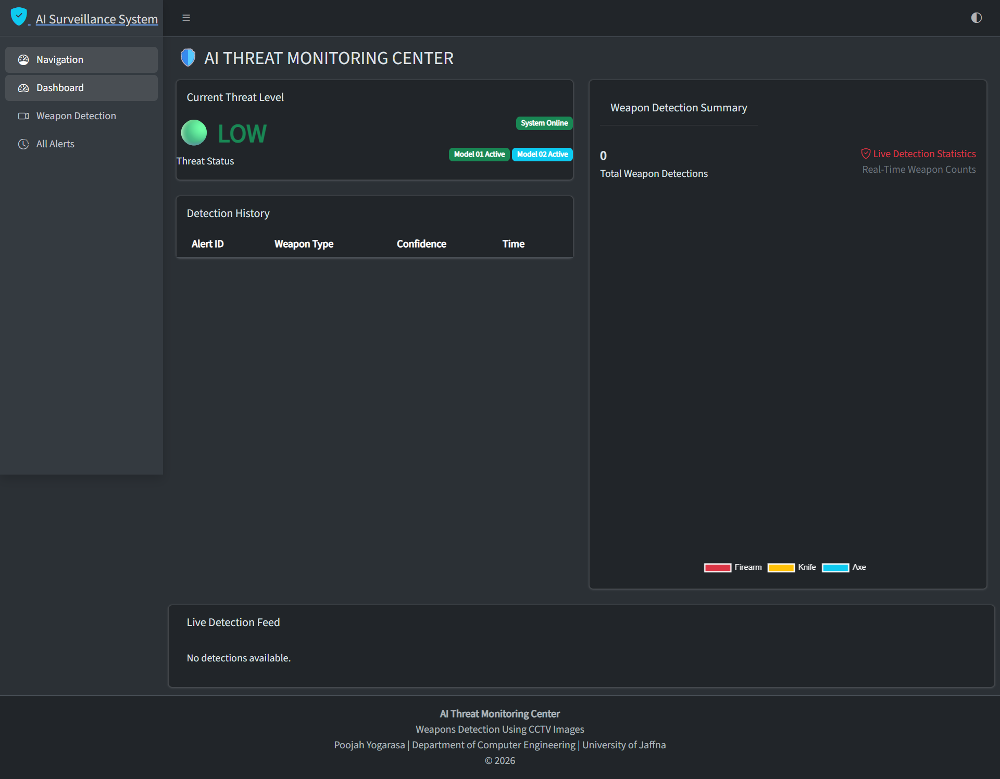
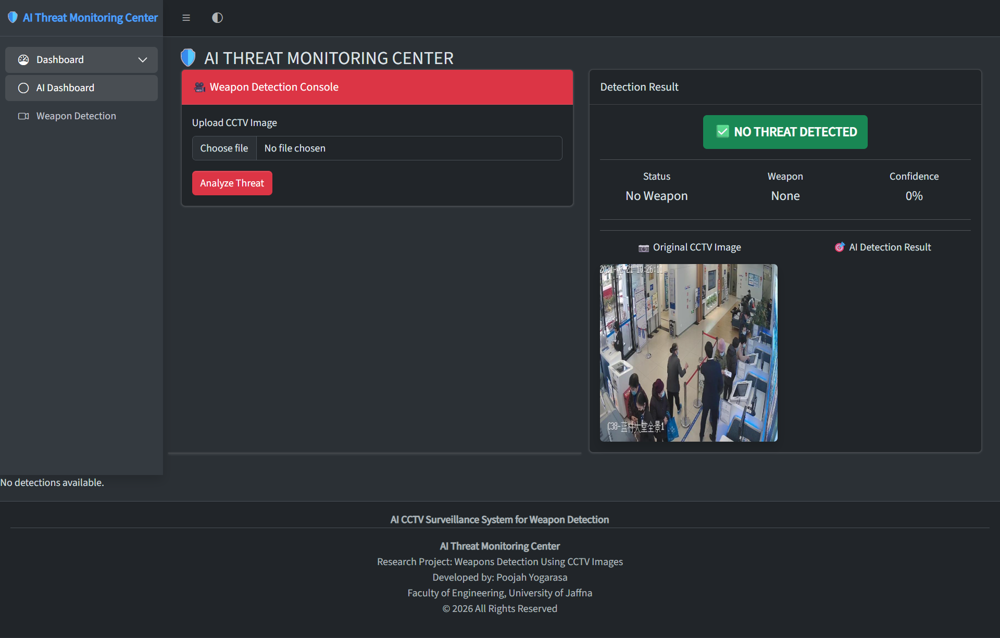
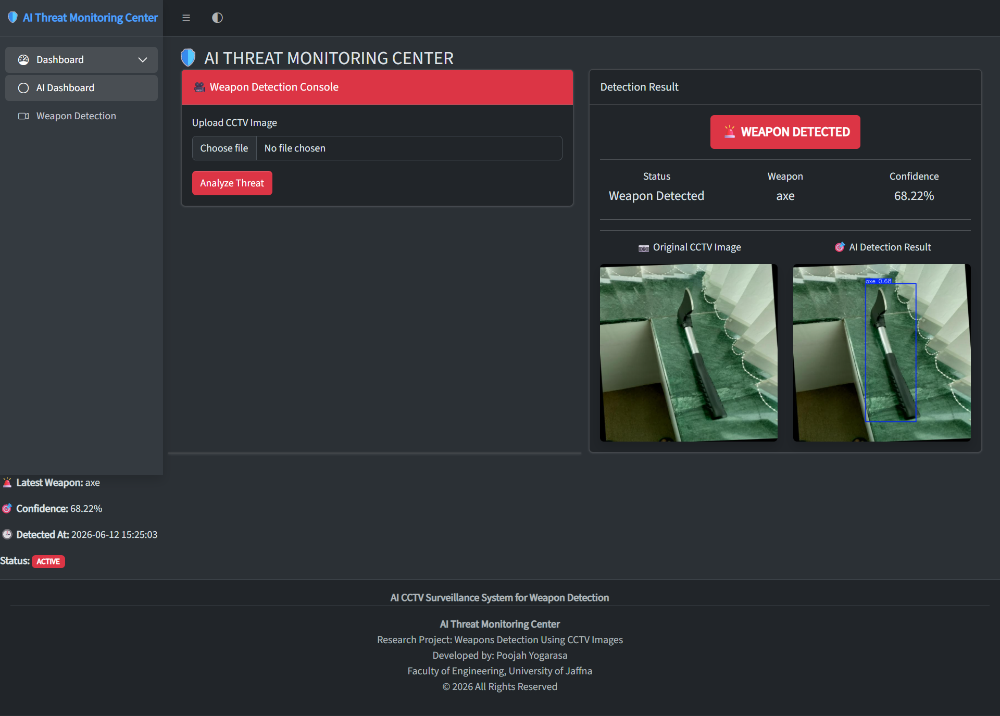
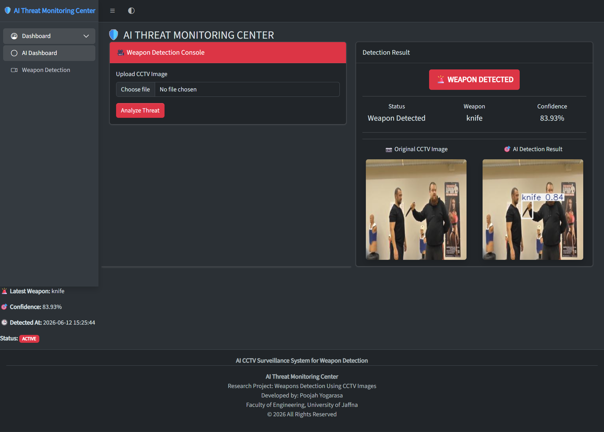
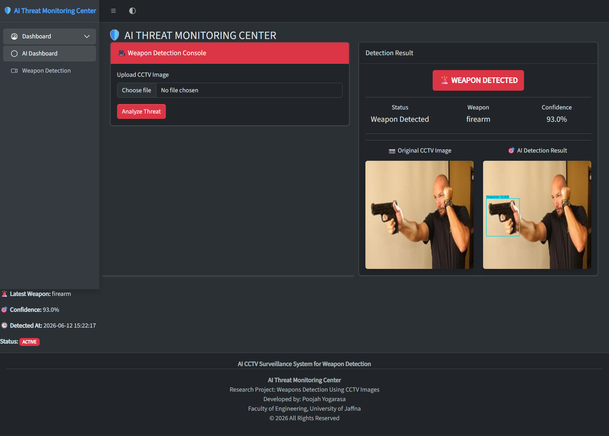
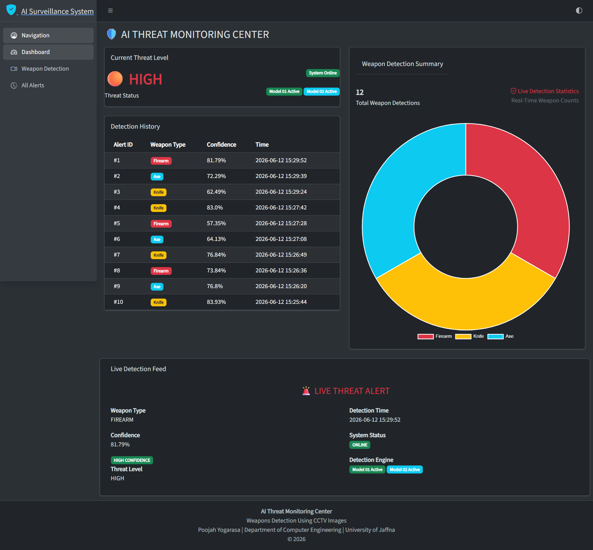
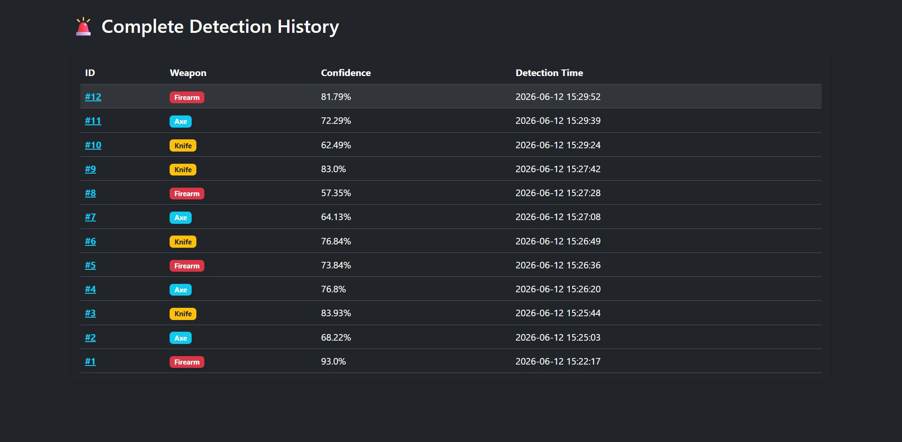
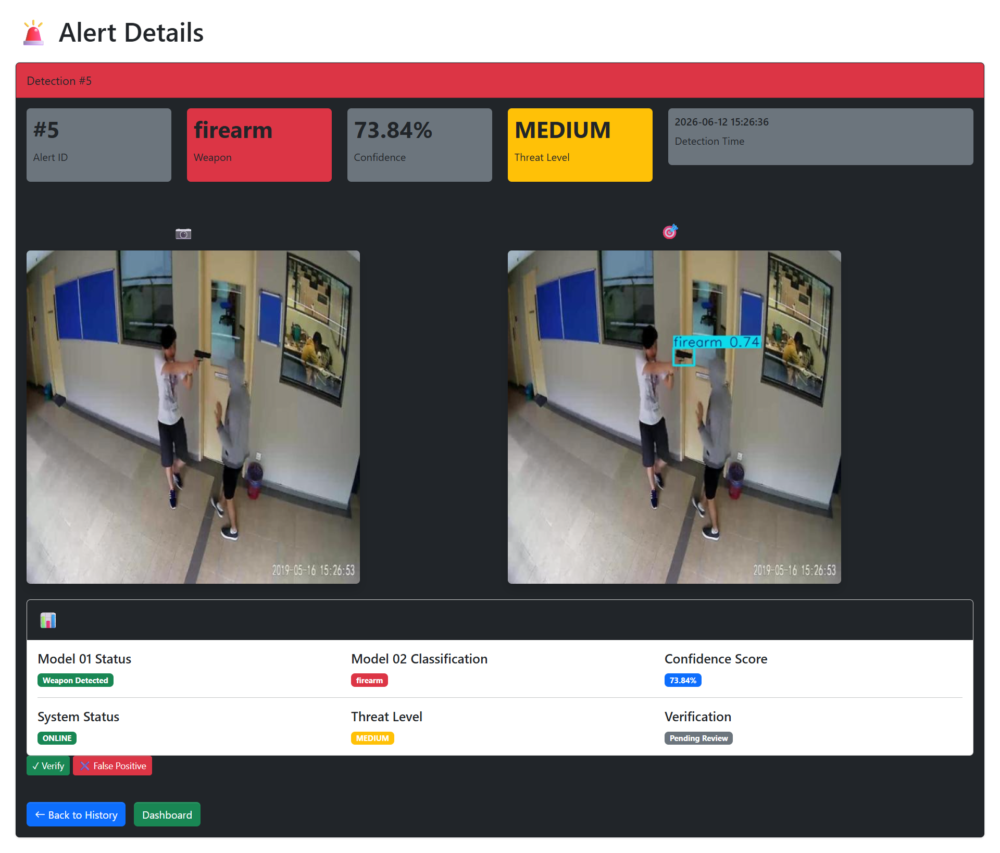
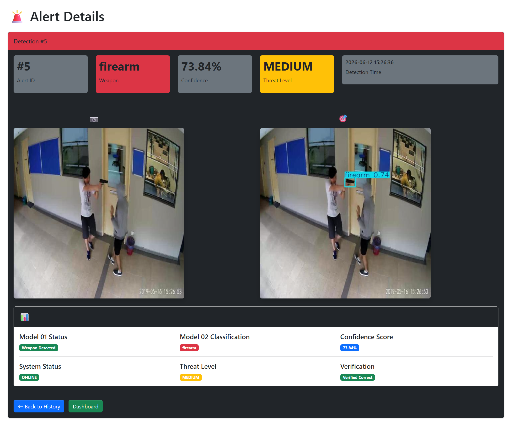

# 🎥 AI CCTV Surveillance Dashboard


## 🛡️ AI-Powered Weapon Detection and Security Monitoring System

An intelligent CCTV surveillance system that automatically detects weapons from CCTV images, classifies weapon types, generates security alerts, and provides a Security Operations Center (SOC) dashboard for real-time threat monitoring.

This project was developed as a research project in the Department of Computer Engineering, University of Jaffna.

---

# 📸 Dashboard Preview

### 🖥️ Main Dashboard (Without Any Detections)



### 🚨 Detection Console (For a Nonweapon)



### 🚨 Detection Console (Axe Detection)



### 🚨 Detection Console (Knife Detection)



### 🚨 Detection Console (Firearm Detection)



### 🖥️ Main Dashboard (After Many Detections)



### 📋 Alert Details



### 📊 Detection History



### 📋 Verification Details



---

# 🚀 Key Features

### 🎯 AI Weapon Detection

* Detects potential weapons from CCTV images
* Supports multiple weapon categories
* Generates alerts automatically

### 🔍 Weapon Classification

Classifies detected weapons into:

* 🔫 Firearm
* 🔪 Knife
* 🪓 Axe

### 🚨 Threat Monitoring

* Automatic alert generation
* Threat level assessment
* Detection confidence monitoring

### 📊 Security Operations Center Dashboard

* Total alerts statistics
* Threat level indicators
* Detection history
* Recent alerts monitoring
* Alert verification workflow

### 🗄️ Database Integration

* Stores all detections
* Tracks alert history
* Supports incident investigation

---

# 🏗️ System Architecture

```text
                  CCTV Image
                       │
                       ▼
          ┌─────────────────────┐
          │   Model 1 (YOLOv8)  │
          │ Weapon / No Weapon  │
          └─────────────────────┘
                       │
                       ▼
          ┌─────────────────────┐
          │   Model 2 (YOLOv8)  │
          │ Weapon Classifier   │
          │ Axe / Knife / Gun   │
          └─────────────────────┘
                       │
                       ▼
          ┌─────────────────────┐
          │ Alert Generation    │
          └─────────────────────┘
                       │
                       ▼
          ┌─────────────────────┐
          │ MySQL Database      │
          └─────────────────────┘
                       │
                       ▼
          ┌─────────────────────┐
          │ SOC Dashboard       │
          └─────────────────────┘
```

---

# 🔄 Detection Workflow

```text
Image Upload
      │
      ▼
Weapon Detection
      │
      ▼
Weapon Classification
      │
      ▼
Threat Assessment
      │
      ▼
Alert Generation
      │
      ▼
Database Storage
      │
      ▼
SOC Dashboard
      │
      ▼
Operator Verification
```

---

# 🧠 AI Models

## Model 1 – Weapon Detection

Purpose:

* Detect whether a weapon is present or not.

Classes:

* Weapon

---

## Model 2 – Weapon Classification

Purpose:

* Identify the detected weapon type.

Classes:

* Axe
* Firearm
* Knife

---

| Model | Precision | Recall | mAP50 |
|---------|---------|---------|---------|
| Model 1 | 75.6% | 58.1% | 60.8% |
| Model 2 | 87.7% | 63.6% | 70.9% |

---

# 📊 Dashboard Modules

### 🏠 Main Dashboard

Displays:

* Total Alerts
* Firearm Alerts
* Knife Alerts
* Axe Alerts
* Threat Level
* Recent Detections

### 🚨 Detection Console

Provides:

* Image Upload
* Detection Results
* Confidence Scores
* Alert Generation

### 📋 Alert Details

Displays:

* Alert Information
* Weapon Type
* Confidence Level
* Alert Time
* Verification Status

### 📜 Detection History

Provides:

* Historical Alert Records
* Incident Investigation Support
* Alert Tracking

---

# 🛠️ Technologies Used

## Backend

* Python
* Flask
* MySQL

## AI & Machine Learning

* YOLOv8
* Ultralytics
* OpenCV

## Frontend

* HTML5
* CSS3
* Bootstrap
* AdminLTE

## Database

* MySQL
* MySQL Connector

## Development Tools

* VS Code
* Git
* GitHub
* Roboflow
* Google Colab

---

# 📁 Project Structure

```text
ai-cctv-surveillance-dashboard
│
├── app.py
├── detector.py
├── requirements.txt
├── README.md
│
├── database/
│   └── db.py
│
├── models/
│   ├── Model_01_best.pt
│   └── Model_02_best.pt
│
├── static/
│   ├── adminlte/
│   ├── css/
│   ├── js/
│   ├── sounds/
│   └── style.css
│
├── templates/
│   ├── index.html
│   ├── detection_console.html
│   ├── alert_details.html
│   ├── all_alerts.html
│   └── admin_dashboard.html
│
└── Demo_Screenshots/
```

---

# 🎯 Research Objective

To develop an intelligent surveillance system capable of automatically detecting weapons in CCTV images and generating alerts to support security personnel in threat identification and rapid response.

---

# 🔮 Future Improvements

* 📹 Live CCTV Stream Integration
* 📧 Email Alert Notifications
* 📱 SMS Alert System
* 🎥 Real-Time Video Detection
* ☁️ Cloud Deployment
* 📊 Advanced Threat Analytics
* 🔔 Mobile Push Notifications
* 🤖 Improved AI Accuracy

---

# 🎓 Academic Context

This project was developed as part of an undergraduate research project "A Two Stage Deep Learning Framework For Weapon Detection And Classification In CCTV Images" in the Department of Computer Engineering, Faculty of Engineering, University of Jaffna.

Research Area:

* Computer Vision
* Artificial Intelligence
* Deep Learning
* Intelligent Surveillance Systems

---

# 👩‍💻 Author

**Poojah Yogarasa**

**Department of Computer Engineering**

**Faculty of Engineering**

**University of Jaffna**

---

# 📄 License

This project is developed for academic and research purposes.
